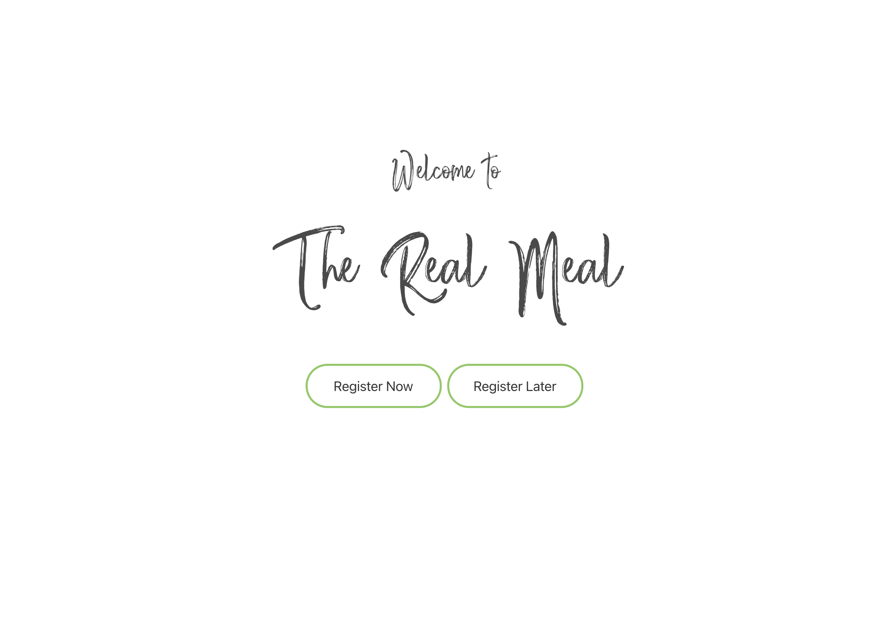

# Project #1: The Real Meal

## Completed by Michael Shaw, Brendan Lewis and Miguel Angel
## UWA Coding Bootcamp

This application was created for a project for UWA's coding bootcamp.

This application makes use the Spoonacular API to generate custom meal plans.

### Getting Started

This project has been deployed to GitHub Pages. To use the application, you can follow the deployment link. Or, download the source files to use this as a template.

* [Deployed GitHub IO](https://michaelshxw.github.io/The-Real-Meal-App/)
* [GitHub Repository](https://github.com/michaelshxw/The-Real-Meal-App)

### Prerequisites
To install this application, a text editor such as Visual Studio Code is required. This can be downloaded [here.](https://code.visualstudio.com/download)

### Languages Used
* HTML 
* CSS
* JavaScript

### Technologies used
* Bulma CSS Framework
* Spoonacular API

### Installation
To install this code, download the zip file, or use GitHub's guidelines to clone the repository

### Summary
* This Work Day Scheduler uses HTML, CSS and JavaScript to display a calendar. Once the user has entered their events, they can save them to localStorage. If they would like to delete them, they can delete them from localStorage. Events entered by the user will remain saved even if they close the browser.
* This project highlights the use of JavaScript to make dynamic changes to a HTML document.

    
### Project Requirements 

### Authors
* **Michael Shaw** [GitHub Profile](https://github.com/michaelshxw)
* **Brendan Lewis** [GitHub Profile](https://github.com/operationBrass)
* **Miguel Angel** [GitHub Profile](https://github.com/miguel-thethird)
